# ProjetoItauDepartamentoUi

Projeto desenvolvido em angular CLI utilizando a coleção de componentes do PrimeNG consumindo os serviços REST do projeto back-end (https://github.com/caiquegustavo/projeto-itau-departamento).
* Design responsivo
* Typescript na chamada das APIs do back-end
* Desenvolvimento estruturado em módulos e componentes

## Tela Inicial de Cadastro de Departamentos
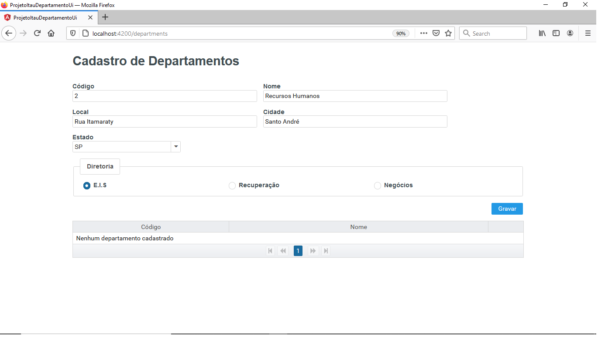

## Preenchimento dos campos do primeiro cadastro de departamentos
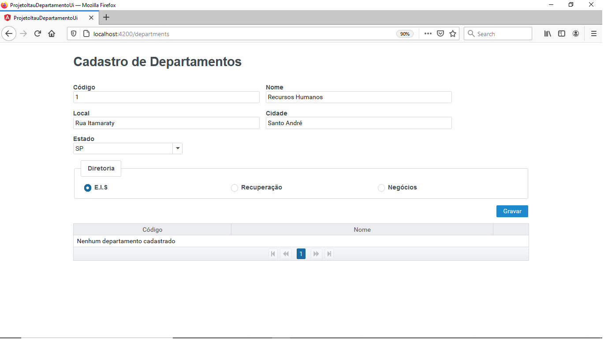

## Cadastro efetuado com sucesso

## Selecionando departamento para edição
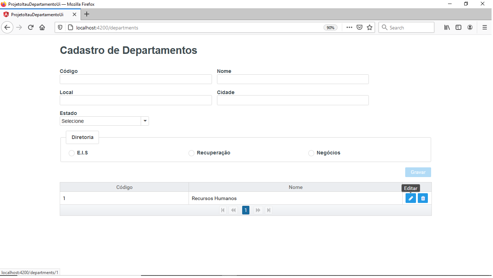

## Tela inicial de edição do departamento
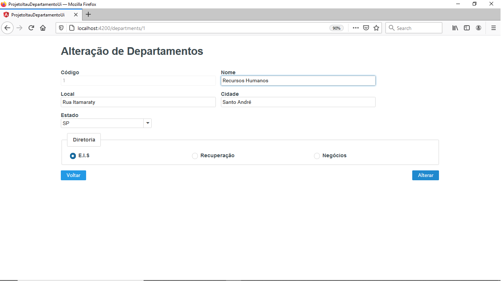

## Editando o departamento
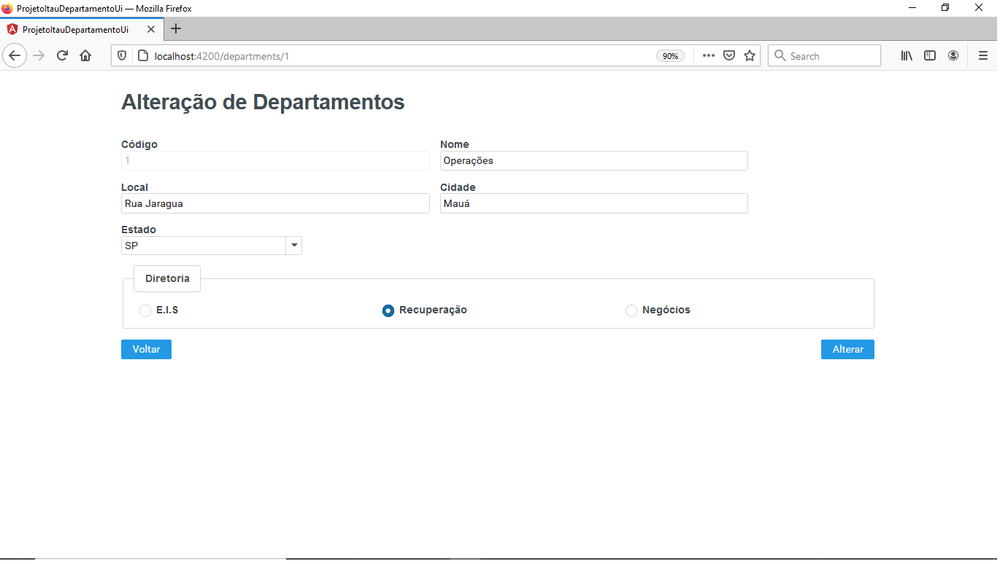

## Departamento alterado com sucesso
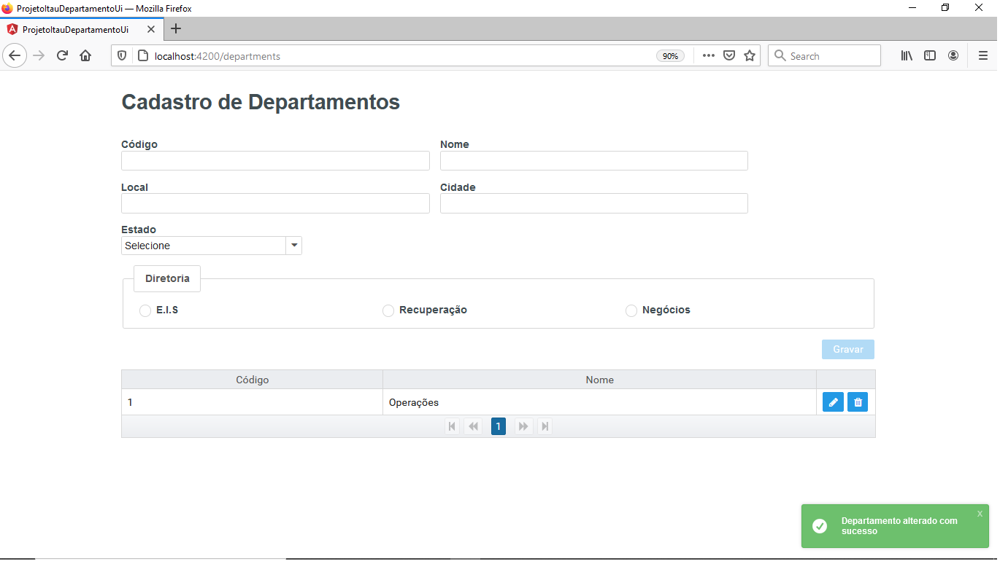

## Selecionando departamento para exclusão
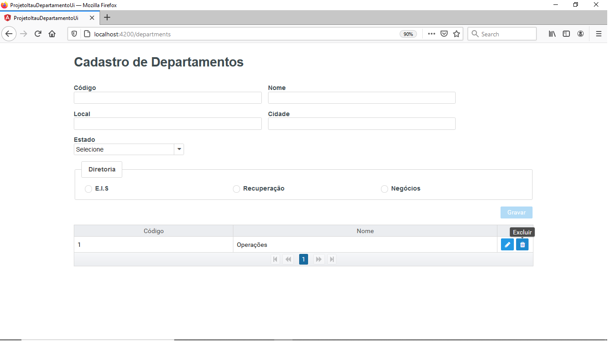

## Confirmação da exclusão do departamento
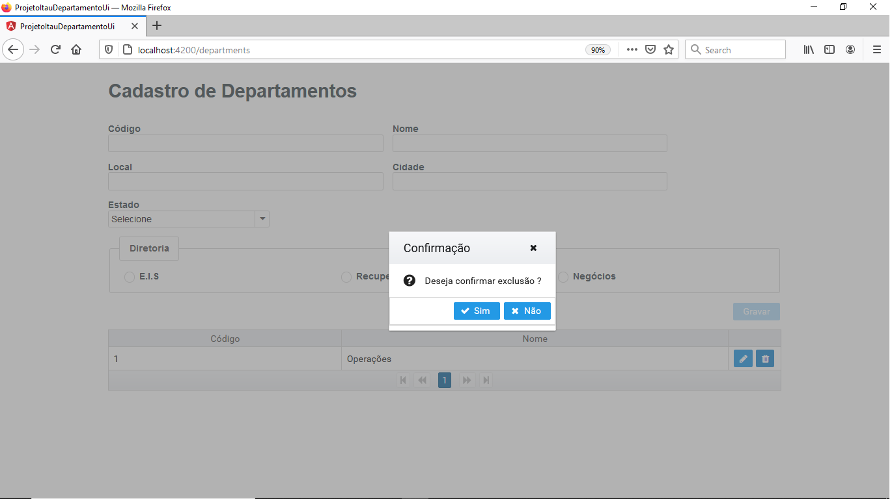

## Departamento excluído com sucesso
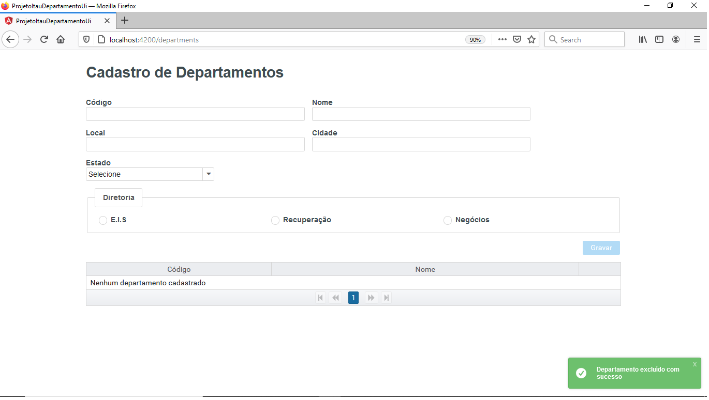

## Listagem de departamentos
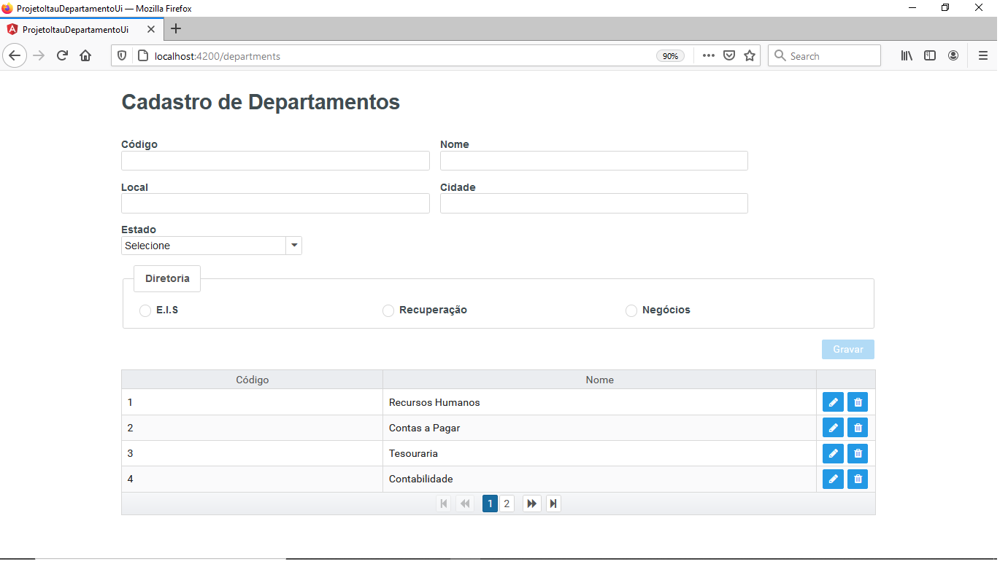

## Validação dos campos de cadastrado
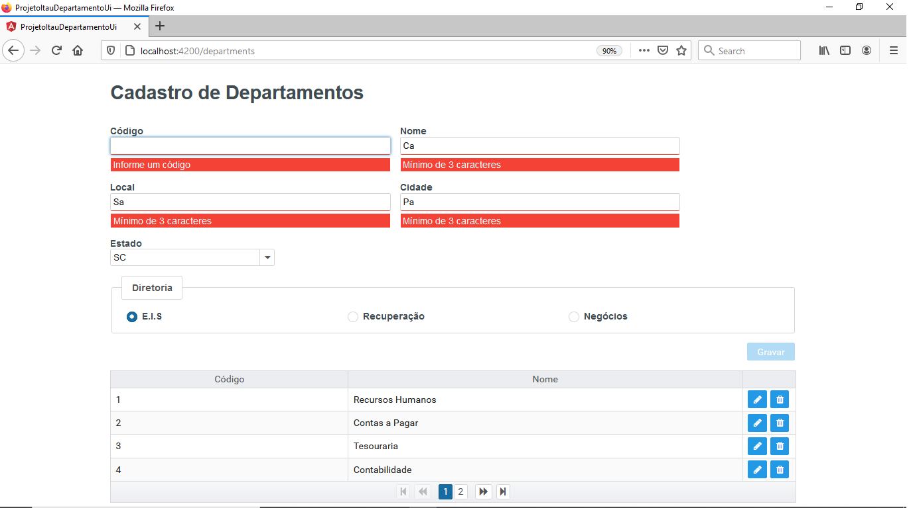

## Validação de departamentos já cadastrado
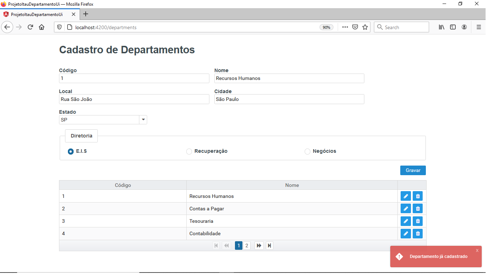

## Visualização da tela em formato de design responsivo
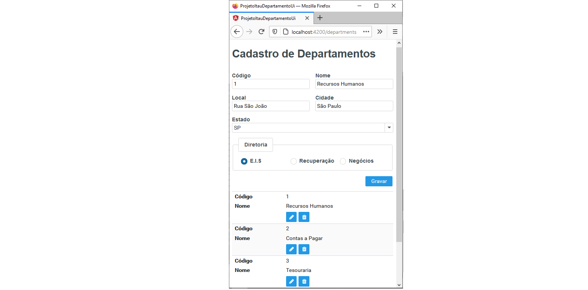